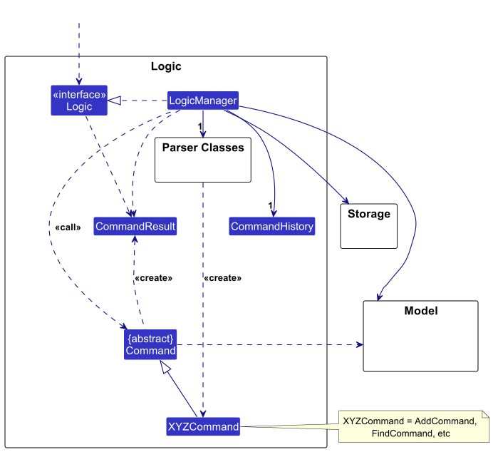
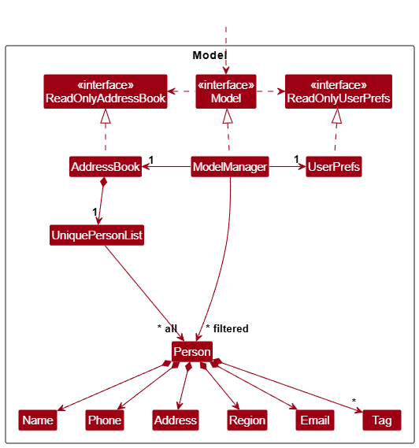
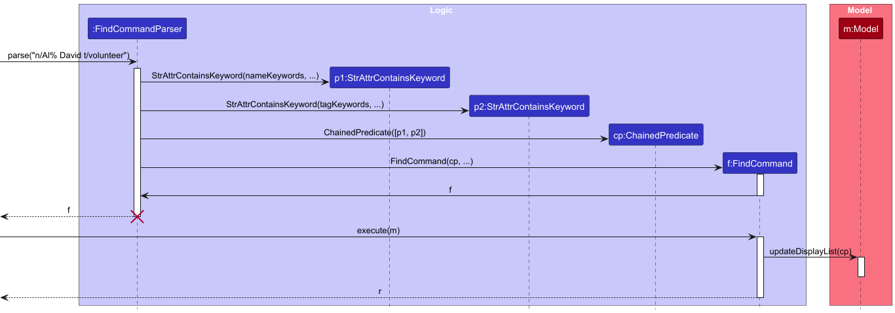
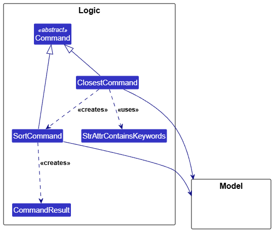
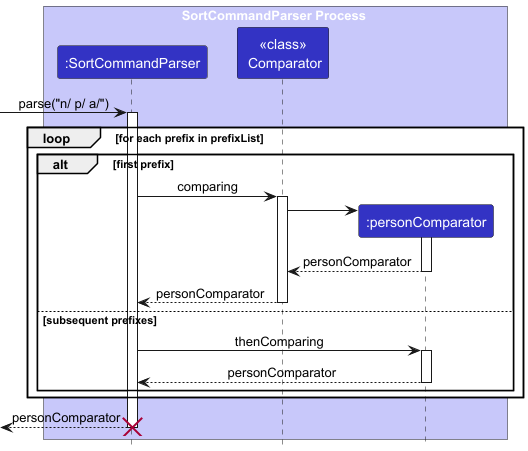
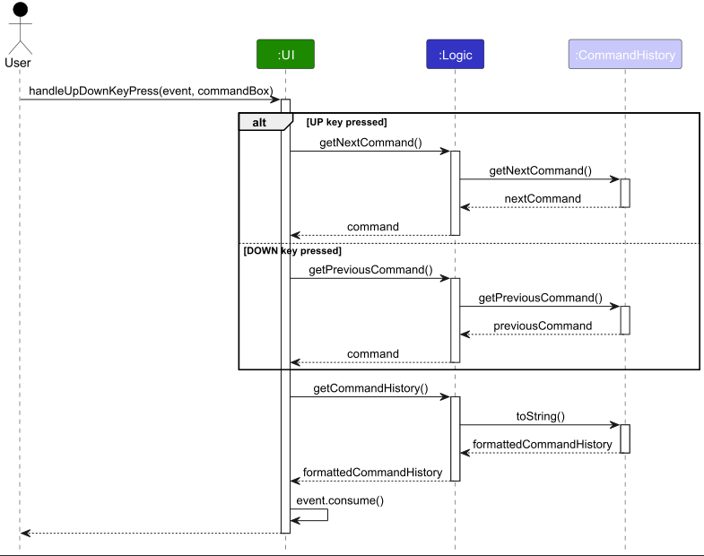
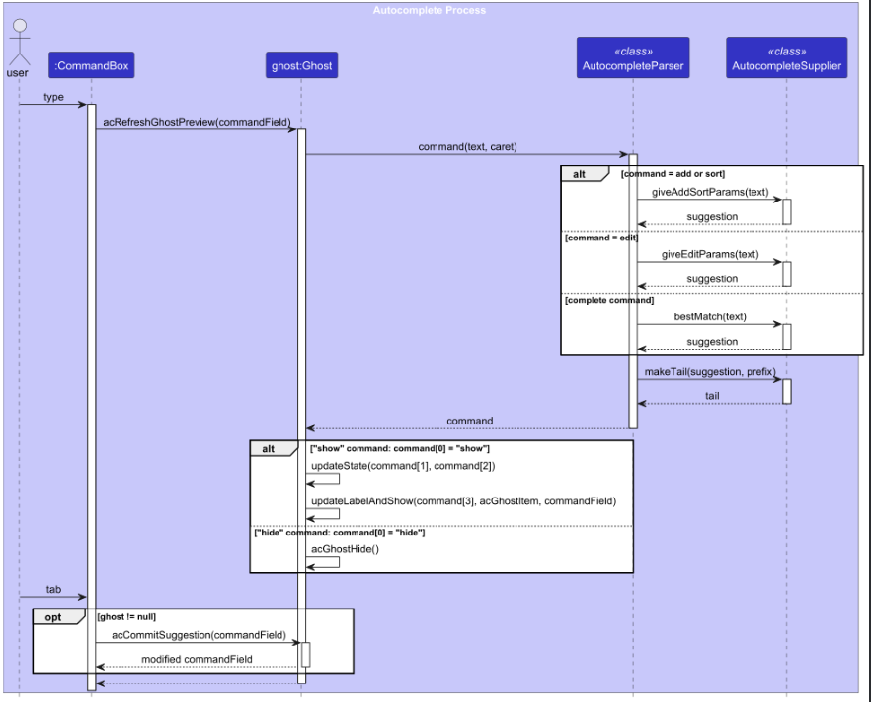

* Table of Contents
{:toc}

--------------------------------------------------------------------------------------------------------------------

## **Acknowledgements**

* Used in the definition of natural sort order in the glossary https://en.wikipedia.org/wiki/Natural_sort_order
* {list here sources of all reused/adapted ideas, code, documentation, and third-party libraries -- include links to the original source as well}

--------------------------------------------------------------------------------------------------------------------

## **Setting up, getting started**

Refer to the guide [_Setting up and getting started_](SettingUp.md).

--------------------------------------------------------------------------------------------------------------------

## **Design**

:bulb: **Tip:** The `.puml` files used to create diagrams are in this document `docs/diagrams` folder. Refer to the [_PlantUML Tutorial_ at se-edu/guides](https://se-education.org/guides/tutorials/plantUml.html) to learn how to create and edit diagrams.

### Architecture

The ***Architecture Diagram*** given above explains the high-level design of the App.

Given below is a quick overview of main components and how they interact with each other.

**Main components of the architecture**

**`Main`** (consisting of classes [`Main`](https://github.com/se-edu/addressbook-level3/tree/master/src/main/java/seedu/address/Main.java) and [`MainApp`](https://github.com/se-edu/addressbook-level3/tree/master/src/main/java/seedu/address/MainApp.java)) is in charge of the app launch and shut down.
* At app launch, it initializes the other components in the correct sequence, and connects them up with each other.
* At shut down, it shuts down the other components and invokes cleanup methods where necessary.

The bulk of the app's work is done by the following four components:

* [**`UI`**](#ui-component): The UI of the App.
* [**`Logic`**](#logic-component): The command executor.
* [**`Model`**](#model-component): Holds the data of the App in memory.
* [**`Storage`**](#storage-component): Reads data from, and writes data to, the hard disk.

[**`Commons`**](#common-classes) represents a collection of classes used by multiple other components.

**How the architecture components interact with each other**

The *Sequence Diagram* below shows how the components interact with each other for the scenario where the user issues the command `delete 1`.

Each of the four main components (also shown in the diagram above),

* defines its *API* in an `interface` with the same name as the Component.
* implements its functionality using a concrete `{Component Name}Manager` class (which follows the corresponding API `interface` mentioned in the previous point.

For example, the `Logic` component defines its API in the `Logic.java` interface and implements its functionality using the `LogicManager.java` class which follows the `Logic` interface. Other components interact with a given component through its interface rather than the concrete class (reason: to prevent outside component's being coupled to the implementation of a component), as illustrated in the (partial) class diagram below.

The sections below give more details of each component.

### UI component

The **API** of this component is specified in [`Ui.java`](https://github.com/se-edu/addressbook-level3/tree/master/src/main/java/seedu/address/ui/Ui.java)

The UI consists of a `MainWindow` that is made up of parts e.g.`CommandBox`, `ResultDisplay`, `PersonListPanel`, `StatusBarFooter` etc. All these, including the `MainWindow`, inherit from the abstract `UiPart` class which captures the commonalities between classes that represent parts of the visible GUI.

The `UI` component uses the JavaFx UI framework. The layout of these UI parts are defined in matching `.fxml` files that are in the `src/main/resources/view` folder. For example, the layout of the [`MainWindow`](https://github.com/se-edu/addressbook-level3/tree/master/src/main/java/seedu/address/ui/MainWindow.java) is specified in [`MainWindow.fxml`](https://github.com/se-edu/addressbook-level3/tree/master/src/main/resources/view/MainWindow.fxml)

The `UI` component,

* executes user commands using the `Logic` component.
* listens for changes to `Model` data so that the UI can be updated with the modified data.
* keeps a reference to the `Logic` component, because the `UI` relies on the `Logic` to execute commands.
* depends on some classes in the `Model` component, as it displays `Person` object residing in the `Model`.

### Logic component

**API** : [`Logic.java`](https://github.com/se-edu/addressbook-level3/tree/master/src/main/java/seedu/address/logic/Logic.java)

Here's a (partial) class diagram of the `Logic` component:

The sequence diagram below illustrates the interactions within the `Logic` component, taking `execute("delete 1")` API call as an example.

:information_source: **Note:** The lifeline for `DeleteCommandParser` should end at the destroy marker (X) but due to a limitation of PlantUML, the lifeline continues till the end of diagram.

How the `Logic` component works:

1. When `Logic` is called upon to execute a command, it is passed to an `AddressBookParser` object which in turn creates a parser that matches the command (e.g., `DeleteCommandParser`) and uses it to parse the command.
1. This results in a `Command` object (more precisely, an object of one of its subclasses e.g., `DeleteCommand`) which is executed by the `LogicManager`.
1. The command can communicate with the `Model` when it is executed (e.g. to delete a person). 
   Note that although this is shown as a single step in the diagram above (for simplicity), in the code it can take several interactions (between the command object and the `Model`) to achieve.
1. The result of the command execution is encapsulated as a `CommandResult` object which is returned back from `Logic`.

Here are the other classes in `Logic` (omitted from the class diagram above) that are used for parsing a user command:

How the parsing works:
* When called upon to parse a user command, the `AddressBookParser` class creates an `XYZCommandParser` (`XYZ` is a placeholder for the specific command name e.g., `AddCommandParser`) which uses the other classes shown above to parse the user command and create a `XYZCommand` object (e.g., `AddCommand`) which the `AddressBookParser` returns back as a `Command` object.
* All `XYZCommandParser` classes (e.g., `AddCommandParser`, `DeleteCommandParser`, ...) inherit from the `Parser` interface so that they can be treated similarly where possible e.g, during testing.

### Model component
**API** : [`Model.java`](https://github.com/se-edu/addressbook-level3/tree/master/src/main/java/seedu/address/model/Model.java)

The `Model` component,

* stores the address book data i.e., all `Person` objects (which are contained in a `UniquePersonList` object).
* stores the currently 'selected' `Person` objects (e.g., results of a search query) as a separate _filtered_ list which is exposed to outsiders as an unmodifiable `ObservableList<Person>` that can be 'observed' e.g. the UI can be bound to this list so that the UI automatically updates when the data in the list change.
* stores a `UserPref` object that represents the user’s preferences. This is exposed to the outside as a `ReadOnlyUserPref` objects.
* does not depend on any of the other three components (as the `Model` represents data entities of the domain, they should make sense on their own without depending on other components)

:information_source: **Note:** An alternative (arguably, a more OOP) model is given below. It has a `Tag` list in the `AddressBook`, which `Person` references. This allows `AddressBook` to only require one `Tag` object per unique tag, instead of each `Person` needing their own `Tag` objects. 

### Storage component

**API** : [`Storage.java`](https://github.com/se-edu/addressbook-level3/tree/master/src/main/java/seedu/address/storage/Storage.java)

The `Storage` component,
* can save both address book data and user preference data in JSON format, and read them back into corresponding objects.
* inherits from both `AddressBookStorage` and `UserPrefStorage`, which means it can be treated as either one (if only the functionality of only one is needed).
* depends on some classes in the `Model` component (because the `Storage` component's job is to save/retrieve objects that belong to the `Model`)

### Common classes

Classes used by multiple components are in the `seedu.address.commons` package.

--------------------------------------------------------------------------------------------------------------------

## **Implementation**

This section describes some noteworthy details on how certain features are implemented.

### Find command

#### Current Implementation
A case-insensitive search is performed with each additional field added to the find command narrowing down the results.
Below is a given sequence diagram illustrating how the find command is executed through the Logic component.

### Closest command

#### Current Implementation
Currently the closest command takes advantage of the Sort command's execution to sort the people by distance to a region and to generate a Command Result.
As such it is heavily dependent on the Sort command's implementation.

It also uses the StrAttrContainsKeywords Predicate class that the Find command uses.

### Closest command

#### Current Implementation
Currently the closest command takes advantage of the Sort command's execution to sort the people by distance to a region and to generate a Command Result.
As such it is heavily dependent on the Sort command's implementation.

It also uses the StrAttrContainsKeywords Predicate class that the Find command uses.

### Sort command parsing

#### Current Implementation
The `SortCommandParser` supports sorting using one or more prefixes.
Each prefix corresponds to an attribute in the `Person` model (name, phone, address, etc.)

How the `SortCommandParser` works:
1. Takes in a list of prefixes.
2. Iterates through each prefix and builds a comparator chain using Java's
`Comparator` interface.
   * For the first prefix, `comparing(...)` is used to initialise a new comparator
   * For subsequent prefixes, `thenComparing(...)` is called to chain additional comparators
3. The resulting `personComparator` compares the attribute in the order the prefixes appear in the command.

Below is a given sequence diagram showing how `SortCommandParser` constructs the comparator incrementally.

## Command History

### Current Implementation
Command history tracks all commands entered during the current session and allows users to navigate through previously
entered commands using the UP and DOWN arrow keys. The command history is managed by the `CommandHistory` class and accessed
through the `Logic` component.

How `CommandHistory` works:
1. The MainWindow class listens for an UP or DOWN key press
2. Depending on which key is pressed, the getNextCommand or getPreviousCommand method is called by Logic
3. After MainWindow has received the corresponding command, Logic then retrieves the full command history through getCommandHistory
4. The Key press event is then consumed within MainWindow

Below is a given sequence diagram illustrating how the command history navigation is
executed through the Logic component.

### \[Proposed\] Undo/redo feature

#### Proposed Implementation

The proposed undo/redo mechanism is facilitated by `VersionedAddressBook`. It extends `AddressBook` with an undo/redo history, stored internally as an `addressBookStateList` and `currentStatePointer`. Additionally, it implements the following operations:

* `VersionedAddressBook#commit()` — Saves the current address book state in its history.
* `VersionedAddressBook#undo()` — Restores the previous address book state from its history.
* `VersionedAddressBook#redo()` — Restores a previously undone address book state from its history.

These operations are exposed in the `Model` interface as `Model#commitAddressBook()`, `Model#undoAddressBook()` and `Model#redoAddressBook()` respectively.

Given below is an example usage scenario and how the undo/redo mechanism behaves at each step.

Step 1. The user launches the application for the first time. The `VersionedAddressBook` will be initialized with the initial address book state, and the `currentStatePointer` pointing to that single address book state.

Step 2. The user executes `delete 5` command to delete the 5th person in the address book. The `delete` command calls `Model#commitAddressBook()`, causing the modified state of the address book after the `delete 5` command executes to be saved in the `addressBookStateList`, and the `currentStatePointer` is shifted to the newly inserted address book state.

Step 3. The user executes `add n/David …​` to add a new person. The `add` command also calls `Model#commitAddressBook()`, causing another modified address book state to be saved into the `addressBookStateList`.

:information_source: **Note:** If a command fails its execution, it will not call `Model#commitAddressBook()`, so the address book state will not be saved into the `addressBookStateList`.

Step 4. The user now decides that adding the person was a mistake, and decides to undo that action by executing the `undo` command. The `undo` command will call `Model#undoAddressBook()`, which will shift the `currentStatePointer` once to the left, pointing it to the previous address book state, and restores the address book to that state.

:information_source: **Note:** If the `currentStatePointer` is at index 0, pointing to the initial AddressBook state, then there are no previous AddressBook states to restore. The `undo` command uses `Model#canUndoAddressBook()` to check if this is the case. If so, it will return an error to the user rather
than attempting to perform the undo.

The following sequence diagram shows how an undo operation goes through the `Logic` component:

:information_source: **Note:** The lifeline for `UndoCommand` should end at the destroy marker (X) but due to a limitation of PlantUML, the lifeline reaches the end of diagram.

Similarly, how an undo operation goes through the `Model` component is shown below:

The `redo` command does the opposite — it calls `Model#redoAddressBook()`, which shifts the `currentStatePointer` once to the right, pointing to the previously undone state, and restores the address book to that state.

:information_source: **Note:** If the `currentStatePointer` is at index `addressBookStateList.size() - 1`, pointing to the latest address book state, then there are no undone AddressBook states to restore. The `redo` command uses `Model#canRedoAddressBook()` to check if this is the case. If so, it will return an error to the user rather than attempting to perform the redo.

Step 5. The user then decides to execute the command `list`. Commands that do not modify the address book, such as `list`, will usually not call `Model#commitAddressBook()`, `Model#undoAddressBook()` or `Model#redoAddressBook()`. Thus, the `addressBookStateList` remains unchanged.

Step 6. The user executes `clear`, which calls `Model#commitAddressBook()`. Since the `currentStatePointer` is not pointing at the end of the `addressBookStateList`, all address book states after the `currentStatePointer` will be purged. Reason: It no longer makes sense to redo the `add n/David …​` command. This is the behavior that most modern desktop applications follow.

The following activity diagram summarizes what happens when a user executes a new command:

#### Design considerations:

**Aspect: How undo & redo executes:**

* **Alternative 1 (current choice):** Saves the entire address book.
  * Pros: Easy to implement.
  * Cons: May have performance issues in terms of memory usage.

* **Alternative 2:** Individual command knows how to undo/redo by
  itself.
  * Pros: Will use less memory (e.g. for `delete`, just save the person being deleted).
  * Cons: We must ensure that the implementation of each individual command are correct.

_{more aspects and alternatives to be added}_

### \[Proposed\] Data archiving

_{Explain here how the data archiving feature will be implemented}_

### Command History

### Autocomplete
Autocomplete consists of three classes:
1. ghost (UI): interacts with commandTextField, manages showing and hiding of suggestion under commandBox.
2. autoCompleteParser(interface): interface for ghost to obtain suggestion, and substrings of suggestions to display. 
Segregates ghost from low-level logic items, such as supplier, and other command items, and vice versa. 
3. autoCompleteSupplier(logic): logic class that interacts with the other logic classes, such as commands, to produce
suggestions for ghost to use. It is only associated with the interface to keep minimum knowledge of the UI.

--------------------------------------------------------------------------------------------------------------------

## **Documentation, logging, testing, configuration, dev-ops**

* [Documentation guide](Documentation.md)
* [Testing guide](Testing.md)
* [Logging guide](Logging.md)
* [Configuration guide](Configuration.md)
* [DevOps guide](DevOps.md)

--------------------------------------------------------------------------------------------------------------------

## **Appendix: Requirements**

### Product scope

**Target User profile**:

1. Social services dispatcher or coordinator that prefer CLI over GUI.
2. They enjoy shortcuts so commands can be performed quickly even while on a call.

**Value proposition**:

1. Manages a database of social workers and beneficiaries.
2. Ability to find the closest worker to beneficiary.
3. Upgraded Find command with additive filters and a wider range of filters, including prefix matching.
4. Sorting for all attributes for volunteers and beneficiaries, with additive comparators.
5. Autocomplete for commands to speed up processes.
6. Command history and reusing past commands.
7. Command Undo to reverse commands (not implemented yet).

### User stories

Priorities: High (must have) - `* * *`, Medium (nice to have) - `* *`, Low (unlikely to have) - `*`

| Priority | As a …​                    | I want to …​                                    | So that I can…​                                                                       |
|----------|----------------------------|-------------------------------------------------|---------------------------------------------------------------------------------------|
| `* * *`  | user                       | delete beneficiaries/volunteers                 |                                                                                       |
| `* * *`  | user                       | add beneficiaries/volunteers                    |                                                                                       |
| `* * *`  | user                       | update beneficiaries/volunteers                 |                                                                                       |
| `* * *`  | user                       | view list of beneficiaries'/volunteers' details |                                                                                       |
| `* * `   | user                       | recall a previous command                       | quickly reuse or edit a previously used command                                       |
| `* *`    | careless person            | see a confirmation tab when deleting a contact  | prevent accidentally deleting someone wrongly.                                        |
| `* *`    | careless person            | undo a previous command                         | prevent permanent data loss due to mistype or wrong command used.                     |
| `* *`    | forgetful person           | filter people by partial keywords               | easily find the right person even if I don't remember their exact name or email.      |
| `* *`    | forgetful person           | autocomplete commands as I type                 | easily key in the correct format even without checking the guide.                     |
| `* *`    | fast typer                 | autocomplete commands as I type                 | increase speed that I execute commands.                                               |
| `* *`    | social service coordinator | filter people staying in a district or region   | easily identify people to dispatch to that region.                                    |
| `* *`    | social service coordinator | find the closest volunteers to a beneficiary    | assign volunteers to beneficiaries quickly or react to emergencies.                   |
| `* *`    | social service coordinator | view detailed information about beneficiaries   | inform social workers and provide them a summary of how to approach them effectively. |
| `* *`    | social service coordinator | group certain social workers in teams           | search for social workers easily by their groups.                                     |

*{More to be added}*

### Use cases

(For all use cases below, the **System** is the `AddressBook` and the **Actor** is the `user`, unless specified otherwise)

**Use case: UC01 - Add a person**

**MSS:**

1.  User requests to add a person with specified details.
2.  AddressBook adds the person to list of persons.

    Use case ends.

**Extensions:**
* 1a. The added person's details are invalid/missing.

    * 1a1. AddressBook shows an error.

      Use case ends.

* 1b. The person to be added already exists in the list.

    * 1b1. AddressBook shows an error.

      Use case ends.

**Use case: UC02 - List persons**

**MSS:**

1.  User requests to list persons.
2.  AddressBook shows a list of persons.

**Extensions:**

* 2a. The list is empty.
    * 2a1. AddressBook tells user list is empty.

      Use case ends.

**Use case: UC03 - Delete person(s)**

**MSS:**
1. User requests to <u>list persons (UC02)</u>.
2. User requests to delete specific person(s) in the list.
3. AddressBook deletes the person.

   Use case ends.

**Extensions:**

* 2a. Invalid/missing identifier(s) for person(s) to delete.

    * 2a1. AddressBook shows an error.

      Use case resumes from step 2.

**Use case: UC04 - Update person's details**

1. User requests to <u>list persons (UC02)</u>.
2. User requests to update person with new details.
3. AddressBook updates the person's details.
4. AddressBook shows the updated details.

   Use case ends.

**Extensions:**
* 2a. The identifier does not match any existing person, or is missing.

    * 2a1. AddressBook shows an error.

      Use case resumes from step 2.

* 2b. The new details are invalid.

    * 2b1. AddressBook shows an error.

      Use case resumes from step 2.

**Use case: UC05 - Find persons by keywords**

1. User requests to find person with a set of keywords for each attribute.
2. AddressBook shows a filtered list of persons matching requirements.

    Use case ends.

**Extensions:**
* 1a. The keyword provided is invalid for that attribute.
    * 1a1. AddressBook shows an error.

      Use case ends

**Use case: UC06 - Sort persons by attributes**

1. User requests to <u>find persons(UC05)</u>.
2. User requests to sort displayed persons by certain attribute.
3. AddressBook shows a sorted list of persons.

   Use case ends.

**Use case: UC07 - Find closest volunteers to beneficiary**

1. User requests to <u>find persons(UC05)</u> to find a beneficiary.
2. User requests to find the volunteers closest to a specified beneficiary.
3. AddressBook shows a list of volunteers sorted by closeness.

   Use case ends.

**Extensions:**
* 2a. Invalid/missing identifier for beneficiary.

    * 2a1. AddressBook shows an error.

      Use case resumes from step 2.

**Use case: UC08 - Recall previous command**

1. User executes some command.
2. User requests to cycle to a previous command.
3. AddressBook selects the previous command for user and displays command history.
4. User chooses a selected recalled command.

   Use case ends.

**Use case: UC09 - Autocomplete command**

1. User partially types a command word.
2. AddressBook shows an autocomplete suggestion.
3. User accepts the suggested autocomplete.
4. AddressBook inserts the suggestion.
5. AddressBook stops displaying suggestion.

   Use case ends.

**Extensions:**
* 2a. User ignores the suggestion and continues typing.

   Use case resumes from step 5.

*{More to be added}*

### Non-Functional Requirements

1. Should run on Windows, macOS, Linux as long as Java17+ is installed, with no OS-specific setup.
2. Should start up to a usable prompt on a mid-range laptop with ~10k contacts with reasonable latency.
3. Should feel snappy: typical commands (add/view/update/delete) should complete in 2 seconds.
4. Should show autocomplete suggestions almost instantly.
5. Should display clear error messages that say what went wrong and how to fix it.
6. Should validate inputs and keep phone/email unique across contacts.
7. Should only be for local use, no internet is required.
8. Should be tailored towards navigating with keyboard.

*{More to be added}*

### Glossary
* **CLI**: Command Line Interface
* **GUI**: Graphical User Interface
* **API**: Application Programming Interface
* **Beneficiary**: Person who benefits from the social service.
* **Volunteer**: Person who provides social service to beneficiaries.
* **Social service coordinator**: Person who manages dispatching of social service workers to beneficiaries.
* **Natural sort order**: Ordering of strings in alphabetical order, except that single- and multi-digit numbers are treated atomically, i.e. as if they were a single character, and compared between themselves by their actual numerical values.

--------------------------------------------------------------------------------------------------------------------

## **Appendix: Instructions for manual testing**

Given below are instructions to test the app manually.

:information_source: **Note:** These instructions only provide a starting point for testers to work on;
testers are expected to do more *exploratory* testing.

### Launch and shutdown

1. Initial launch

   1. Download the jar file and copy into an empty folder

   1. Double-click the jar file Expected: Shows the GUI with a set of sample contacts. The window size may not be optimum.

1. Saving window preferences

   1. Resize the window to an optimum size. Move the window to a different location. Close the window.

   1. Re-launch the app by double-clicking the jar file. 
       Expected: The most recent window size and location is retained.

1. _{ more test cases …​ }_

### Deleting a person

1. Deleting a person while all persons are being shown

   1. Prerequisites: List all persons using the `list` command. Multiple persons in the list.

   1. Test case: `delete 1` 
      Expected: First contact is deleted from the list. Details of the deleted contact shown in the status message. Timestamp in the status bar is updated.

   1. Test case: `delete 1 2` 
      Expected: First and second contacts are deleted from the list. Details of the deleted contacts shown in the status message. Timestamp in the status bar is updated.

   1. Test case: `delete 0` 
      Expected: No person is deleted. Error details shown in the status message. Status bar remains the same.

   1. Other incorrect delete commands to try: `delete`, `delete x`, `...` (where x is larger than the list size) 
      Expected: Similar to previous.

1. _{ more test cases …​ }_

### Finding a person
1. Finding a person while all persons are being shown
   1. Prerequisites: List all persons using the `list` command. Multiple persons in the list.
   2. Test case: `find n/John` 
    Expected: Only contacts whose names start with "John" appear in the list.
   The status bar at the bottom shows what it is finding by.
   3. Test case: `find n/John t/volunteer`
    Expected: Only contacts with the name "John" and "volunteer" tag appear.
   The status bar at the bottom shows what it is finding by.
   4. Test case: `find n/` 
    Expected: The list does not change. Error details shown in the status message. Status bar remains the same.
   5. Other find commands to try: `find p/PHONE_KEYWORDS`, `find a/ADDRESS_KEYWORDS`, `...`(where ..._KEYWORDS are the respective inputs for the attribute)
2. _{ more test cases …​ }_

### Sorting the list
1. Sorting a list while all persons are being shown
   1. Prerequisites: List all persons using the `list` command. Multiple persons in the list.
   2. Test case: `sort n/` 
   Expected: Contacts are rearranged alphabetically by name in the list. The status bar at the bottom shows it is sorted by name.
   3. Test case: `sort n/123` 
   Expected: Similar to previous.
   4. Test case: `sort t/ n/` 
   Expected: Contacts are grouped by tags (beneficiary before volunteer), then alphabetically by name. The status bar at
   the bottom shows it is sorted by tags and name.
   5. Test case: `sort` 
   Expected: The list does not change. Error details are shown in the status message. Status bar remains the same.
   6. Other sort commands to try: `sort a/`, `sort r/` 
   Expected: Contacts are sorted by their attribute in natural sort order.

### Autocomplete
1. Typing in any command in the CLI
   1. Type `f` then press **Tab**.  
   Expected: Autocompletes to `find`.
   2. Type `find` and **Space** and then press **Tab**.  
   Expected: Autocompletes to `find n/`
   3. After typing `find n/`, type "John" as an input. Then, type **Space** and press **Tab**.  
   Expected: Autocompletes to `find n/John p/`

### Command History
1. Cycling through any past commands
   1. Prerequisites: Some commands have already been used. Enter `list`, then `find n/Alex`, then `sort n/`.
   2. Press the ↑ **Up**.  
   Expected: `sort n/` appears in the CLI. Command history appears with a pointer to the most recent command.
   3. Press the ↑ **Up**.  
   Expected: `list` appears in the CLI. Pointer in command history points to `list`
   4. Press the ↓ **Down**.  
   Expected: `sort n/` appears in the CLI. Pointer in command history points to `sort n/`.
   5. Enter a new command `find n/John` and press ↑ **Up**.  
   Expected: `find n/John` appears in the CLI. Pointer in command history points to `find n/John`.

2. _{ more test cases …​ }_

### Saving data

1. Dealing with missing/corrupted data files

   1. _{explain how to simulate a missing/corrupted file, and the expected behavior}_

1. _{ more test cases …​ }_

--------------------------------------------------------------------------------------------------------------------

## **Appendix: Planned Enhancements**

Team size: 5

1. **Command history deletes current command**: Currently, when a command is being typed out and either the `UP` or
   `DOWN` key is pressed, the current command typed out gets lost. We plan to temporarily store the typed command in the
   command history.
2. **Command history key selecting autocomplete suggestion**: When the command has a autocomplete suggestion,
   pressing `UP` or `DOWN` key selects the autocomplete suggestion. As this is caused by the default behaviour of the
   JavaFX label, we plan to override this behaviour so that only command history has control over the
`UP` or `DOWN` key.
3. **Utilisation of vertical space by command result messages is poor**: Currently, whenever the Person string
   representation is used in the result box like in `Edit`, `Add` ie `Delete`, it puts it in one continuous line and
only wraps around at the boundary. Separating each attribute into separate lines could better match the GUI
representation in the contact list and make it more readable.
4. **Autocomplete blocks "enter" from sending the command**: The autocompleted prefix suggestion lingers until the next
`SPACE` press. A valid command such as `sort n/` may thus require 2 enter presses. We plan to get rid of the suggestion
once a valid command has been typed fully.
5. **Shortcut for accessing the CLI for UI**: Clicking the copy button on the contact person's information will exit
the CLI. We plan to have a keyboard shortcut to access the CLI.
6. **Unable to add 2 people of the same name**: We have disabled the feature of adding 2 people of the same name to
avoid duplicate contacts. We plan to do duplicate checks based on phone and email.
