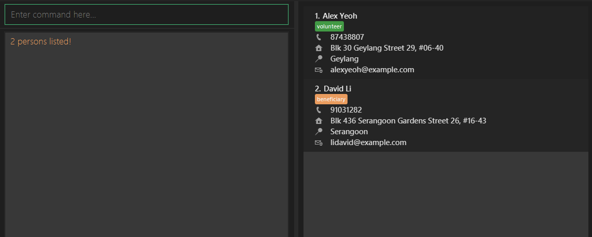
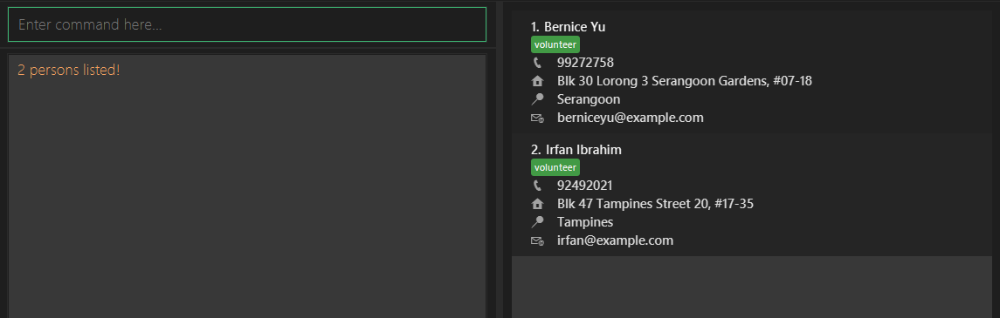

CareLink helps Non-Governmental Organisations (NGOs) deliver social assistance efficiently by 
connecting beneficiaries to social workers as quickly as possible. 🤝

NGOs often serve a large number of beneficiaries with a limited pool of social workers, 
making it challenging to respond promptly to those in need.

By consolidating beneficiary and worker data into a single, streamlined system 📚, CareLink enables dispatchers to:

* 📝 create and update records for beneficiaries and social workers
* 🔍 access information quickly using **optimized find and sort commands**
* 📍 automatically identify the **closest available social worker**
* 📈 reduce errors and delays caused by manual lookups or outdated records

In short, CareLink **enhances coordination efforts** between social workers and beneficiaries 
through the **fast retrieval** of contact details 💙

## Table of Contents

- [Quick start](#quick-start)

- <a href="#features">Features</a>

    - [Command Format](#command-format)

    - [Viewing help : `help`](#viewing-help--help)

    - <a href="#contacts-management">Contacts Management</a>

      - [Adding a person: `add`](#adding-a-person-add)

      - [Editing a person : `edit`](#editing-a-person--edit)

      - [Deleting a person : `delete`](#deleting-a-person--delete)

      - [Clearing all entries : `clear`](#clearing-all-entries--clear)

    - <a href="#display-and-searching">Display and Searching</a>

      - [Listing all persons : `list`](#listing-all-persons--list)

      - [Locating persons: `find`](#locating-persons-find)

      - [Sorting persons: `sort`](#sorting-persons-sort)

    - <a href="#advanced-features">Advanced Features</a>

      - [Cycling between commands : `UP_Key DOWN_Key`](#cycling-between-commands)

      - [Autocomplete : `TAB_Key`](#autocomplete)

      - [Saving the data](#saving-the-data)

      - [Editing the data file](#editing-the-data-file)

      - [Archiving data files `[coming in v2.0]`](#archiving-data-files-coming-in-v20)

    - [Exiting the program : `exit`](#exiting-the-program--exit)

    - [Valid Attributes for person](#valid-attributes)

- [FAQ](#faq)

- [Known issues](#known-issues)

- [Command summary](#command-summary)

--------------------------------------------------------------------------------------------------------------------

## Quick start

#### 1️⃣ Install Java (if you haven’t already)

CareLink requires **Java 17 or above** to run.

* If **Java 17 or above** is not installed, please follow the specific installation instructions mentioned [here](https://se-education.org/guides/tutorials/javaInstallation.html) to avoid version issues

**:information_source: Follow the guide that fits your computer's operating system** 

#### 2️⃣ Download CareLink

Download the latest **CareLink `.jar` file** from our [Releases page](https://github.com/AY2526S1-CS2103T-W13-1/tp/releases)

#### 3️⃣ Choose a Home Folder

Move the downloaded `.jar` file to a folder where you want CareLink to store your volunteer and organization data.
You get to choose the location. Treat it as your _CareLink Home Folder_.

#### 4️⃣ Launch CareLink

1.  Open your **Command Prompt** for Windows / **Terminal** for Mac

2.  Navigate to your CareLink Home folder:

    `cd path/to/home_folder`

    For example, if CareLink Home folder is `C:/usr/folder/CareLink` and the terminal is pointing to `C:/usr`, run the command `cd folder/CareLink`.

    Your terminal should now show you are inside that folder.

3.  Run CareLink:

    `java -jar addressbook.jar`

 
A few seconds later, the CareLink interface will greet you with sample volunteer data so you can explore comfortably.

#### 5️⃣ Try Out Some Commands

In the command box at the bottom, type a command and hit **Enter** to execute.

Some useful examples for volunteer admin staff:

   * `list` : Lists all contacts.

   * `add n/John Doe p/98765432 e/johnd@example.com a/John street, block 123, #01-01 r/yishun t/volunteer` : Adds a contact named `John Doe` to the Address Book.

   * `delete 3` : Deletes the 3rd contact shown in the current list.

   * `clear` : Deletes all contacts.

   * `exit` : Exits the app.

#### 6️⃣ Learn More

Details of every feature and command can be found in the [Features](#features) section below. You will soon explore assigning roles, tracking participation, and keeping volunteer info updated effortlessly!

-----

## Features
-----

### Command Format

**:information_source: Notes about the command format:** 

* Words in `UPPER_CASE` are the attributes to be supplied by the user. 
  e.g. in `add n/NAME`, `NAME` is a attribute which can be used as `add n/John Doe`, `n/` is its attribute prefix.

* Items in square brackets are optional. 
  e.g `n/NAME [t/TAG]` can be used as `n/John Doe t/friend` or as `n/John Doe`.

* Items in with `|` are valid inputs. 
  e.g `t/volunteer|beneficiary` can be used as `t/volunteer` or as `t/beneficiary`.

* Items with `…`​ after them can be used multiple times including zero times. 
  e.g. `[t/TAG]…​` can be used as ` ` (i.e. 0 times), `t/friend`, `t/friend t/family` etc.

* Attributes can be in any order. 
  e.g. if the command specifies `n/NAME p/PHONE_NUMBER`, `p/PHONE_NUMBER n/NAME` is also acceptable.

* Extraneous attributes for commands that do not take in attributes (such as `help`, `list`, `exit` and `clear`) will be ignored. 
  e.g. if the command specifies `help 123`, it will be interpreted as `help`.

* If you are using a PDF version of this document, be careful when copying and pasting commands that span multiple lines as space characters surrounding line-breaks may be omitted when copied over to the application.

------

### Viewing help : `help`

Shows a message explaining how to access the help page.

**✏️ Format:** 
`help`

**🎯 Expected Outcome:**
* Opens a window that allows you to copy the link to the User Guide website

**📘 Examples:**
* `help` 

  

[▲ Back to Table of Contents](#table-of-contents)

------

## Contacts Management
-----

### Adding a person: `add`

Adds a person to the address book.

**✏️ Format:** 
`add n/NAME p/PHONE_NUMBER e/EMAIL a/ADDRESS r/REGION t/volunteer|beneficiary [t/TAG]…​`

:information_source: **Important Note:**  
* Attributes must follow [Valid Attributes](#valid-attributes)
* A person can have any number of tags, but must have a tag that is either volunteer or beneficiary
* A person's attributes can be edited via `edit` later on, however all attributes must first be provided

**🎯 Expected Outcome:**
* Adds a new person to the list with the given details
  * e.g. `add n/John Doe p/98765432 e/johnd@example.com a/John street, block 123, #01-01 r/woodlands t/volunteer` will add John Doe to the list and set his attributes to the given attributes

**📘 Examples:**
* `add n/John Doe p/98765432 e/johnd@example.com a/John street, block 123, #01-01 r/woodlands t/volunteer`
* `add n/Betsy Crowe e/betsycrowe@example.com a/24 Mandai Garden street r/yishun p/1234567 t/beneficiary t/senior`

  

[▲ Back to Table of Contents](#table-of-contents)

------

### Editing a person : `edit`

Edits an existing person in the address book.

**✏️ Format:** 
`edit INDEX [n/NAME] [p/PHONE] [e/EMAIL] [a/ADDRESS] [r/REGION] [t/TAG]…​`

:information_source: **Important Note:**  
* Edits the person at the specified `INDEX`. The index refers to the index number shown in the displayed person list. The index **must be a positive integer** 1, 2, 3, …​
* The index is affected by `find` and `sort`
* At least one of the optional fields must be provided.
* Attributes must follow [Valid Attributes](#valid-attributes)
* If tags are edited, must include a tag indicating volunteer or beneficiary.
* Existing values will be updated to the input values.
* When editing tags, the existing tags of the person will be removed i.e adding of tags is not cumulative.

**🎯 Expected Outcome:**
* Edits existing person in the list with the given details
  * e.g. `edit 5 p/98765432` will edit the phone number of the person at index `5` in the list to `98765432`

**📘 Examples:**
*  `edit 1 p/91234567 e/johndoe@example.com` Edits the phone number and email address of the 1st person to be `91234567` and `johndoe@example.com` respectively.
*  `edit 2 n/Betsy Crower` Edits the name of the 2nd person to be `Betsy Crower`

  

[▲ Back to Table of Contents](#table-of-contents)

------
### Deleting a person : `delete`

Deletes one or more specified persons from the address book.

**✏️ Format:** 
`delete INDEX [MORE_INDEXES]...`

:information_source: **Important Note:**  
* Each index refers to the index number shown in the displayed person list.
* A minimum of one index must be specified
* Each index must be a **whole number greater than 0** e.g. 1, 2, 3, …​
* The order of the indexes do not matter e.g. `delete 1 2` and `delete 2 1` will both delete the first two contacts
* Spaces must be used to separate indexes e.g. `delete 12` will delete the 12th contact instead of the first two
contacts

**🎯 Expected Outcome:**
* Deletes the person(s) at the specified `INDEX` and `[MORE_INDEXES]...` (if specified).

**📘 Examples:**
* `list` followed by `delete 2` deletes the 2nd person in the address book.
* `find Betsy` followed by `delete 1 2` deletes the 1st and 2nd persons in the results of the `find` command.

  

[▲ Back to Table of Contents](#table-of-contents)

------

### Clearing all entries : `clear`

Deletes all contacts in the address book.

:exclamation: **Caution:**  
* This command will permanently delete **all** contacts in the address book.
* Please think carefully before executing this **irreversible** action.
* No extra input is needed

**✏️ Format:** 
`clear`

**🎯 Expected Outcome:**
* Deletes all persons in CareLink.

  

[▲ Back to Table of Contents](#table-of-contents)

------

## Display and Searching
-----

### Listing all persons : `list`

Shows a list of all persons in the address book.

**✏️ Format:** 
`list`

**🎯 Expected Outcome:**
* Displays all persons' contact details in the address book.
* At the panel below the command box, you can see the total number of contacts.

**📘 Examples:**
* `list` 

  

[▲ Back to Table of Contents](#table-of-contents)

------

### Locating persons: `find`

Filters persons whose fields match the keywords.

**✏️ Format:** 
`find [n/NAME_KEYWORDS] [p/PHONE_KEYWORDS] [e/EMAIL_KEYWORDS] [a/ADDRESS_KEYWORDS] [t/TAG_KEYWORDS]`

:information_source: **Important Note:**  
* The search is <u>case-insensitive</u> e.g `n/hans` will match `Hans`.
* The order of the keywords does not matter. e.g. `n/Hans Bo` will match `Bo Hans`.
 Multiple keywords per field are allowed. e.g. `n/Hans Bo` will match `Hans Lee` and `Bo Bae`.
* Only full words will be matched e.g. `n/Han` will not match `Hans`, `p/94628739` will not match `9462 8739`.

**🎯 Expected Outcome:**
* Displays all persons who matches at least one keyword in each given field.
  * e.g. `find n/Hans p/1234` will return all persons whose names contain `Hans` <u>and</u> whose phone number is `1234`.

**📘 Examples:**
* `find n/alex david` returns `Alex Yeoh`, `David Li` 
  

* `find n/irfan bernice t/volunteer` returns `Bernice Lee` and `Irfan Ibrahim`, who are both `volunteers`  
    

  

[▲ Back to Table of Contents](#table-of-contents)

------

### Sorting persons: `sort`

Sorts persons by the fields in the order of the attribute prefixes

**✏️ Format:** 
`sort [n/] [p/] [e/] [a/] [t/]`

:information_source: **Important Note:**
* Order of sorting follows the natural order. e.g. 4th comes before 10th.
* Order of attribute prefixes defines the order of sorting.
  e.g. `n/ p/` sorts name then sorts phone number, `p/ n/` sorts phone number then name
* Sorting by **tags** will group the tags by **beneficiary** and **volunteer**.
* Calling sort after any command will sort the current displayed list.

**🎯 Expected Outcome:**
* Displays all persons in the specified sorted order
  * e.g. `sort n/` will return all persons sorted by their names in alphabetical order

  

[▲ Back to Table of Contents](#table-of-contents)

------

## Advanced Features
-----

### Cycling between commands

Cycles between commands in the command history.

**⌨ Usage:** 
* Press `⬆ UP Key`: Goes to the previous command in history

* Press `⬇ DOWN Key`: Goes to the next command in history

  

[▲ Back to Table of Contents](#table-of-contents)

------

### Autocomplete

Provides suggestions to autocomplete your input text. Autocompletes command words and attribute prefixes like `n/`.

**⌨ Usage:** 
* Press `⇥ Tab`: Autocomplete with the suggestion that appears below command box.

:bulb: **Tip:**
Press **Tab** to complete the prefix and start typing an attribute. When you finish it, press **Space** and the next attribute prefix will be suggested automatically.

**📘 Examples:**
* Autocomplete of command `delete`   

  

[▲ Back to Table of Contents](#table-of-contents)

------

### Saving the data

AddressBook data are saved in the hard disk automatically after any command that changes the data. There is no need to save manually.

### Editing the data file

AddressBook data are saved automatically as a JSON file `[JAR file location]/data/addressbook.json`. Advanced users are welcome to update data directly by editing that data file.

:exclamation: **Caution:**
If your changes to the data file makes its format invalid, AddressBook will discard all data and start with an empty data file at the next run. Hence, it is recommended to take a backup of the file before editing it. 
Furthermore, certain edits can cause the AddressBook to behave in unexpected ways (e.g., if a value entered is outside of the acceptable range). Therefore, edit the data file only if you are confident that you can update it correctly.

  

[▲ Back to Table of Contents](#table-of-contents)

------

### Archiving data files `[coming in v2.0]`

_Details coming soon ..._

------

### Exiting the program : `exit`

Exits the program.

**✏️ Format:** 
`exit`

**🎯 Expected Outcome:**
* The display window closes and CareLink stops running.

  

[▲ Back to Table of Contents](#table-of-contents)

------

## Valid Attributes
### 👤 Name

Alphanumeric + spaces only, not blank.

* `Alice Tan`
* `John Doe`
* `Li Wei`
* `Aisyah`
* `Bob 2`

### 📧 Email

Emails must follow: `local-part@domain`, allowed special chars in local part (`+_.-`), no leading/trailing special chars, domain labels alphanumeric & ≥2 letters at the end.

* `alice@example.com`
* `john_doe123@mail.sg`
* `alex+promo@sub-domain.co.uk`
* `my.email@ntu.edu.sg`
* `contact-1@tech-startup.io`
* `user123@domain99.net`

### 📞 Phone Number

Digits only, at least 3 numbers long.

* `999`
* `98765432`
* `65123456`
* `1800123`

### 🌍 Region

Regions must be a valid region (listed below):

* Woodlands
* Yishun
* Sembawang
* Mandai
* Sungei Kadut
* Punggol
* Sengkang
* Hougang
* Seletar
* Serangoon
* Pasir Ris
* Tampines
* Bedok
* Paya Lebar
* Changi
* Toa Payoh
* Bishan
* Ang Mo Kio
* Novena
* Geylang
* Marine Parade
* Kallang
* Queenstown
* Bukit Merah
* Bukit Timah
* Tanglin
* River Valley
* Jurong West
* Jurong East
* Boon Lay
* Clementi
* Bukit Batok
* Bukit Panjang
* Tuas
* Lim Chu Kang
* Western Water Catchment
* Tengah

### 🏠 Address

Address can be any non-blank string.

-   `21 Lower Kent Ridge Rd, Singapore`
-   `Block 123, #02-45 Clementi Ave 3`
-   `10 Dover Drive`
-   `Jurong West Street 42`
-   `Marina Bay Sands Tower 1`

### 🏷️ Tags

Tags are alphanumeric, at least one tag must be `volunteer` or `beneficiary`.

  

[▲ Back to Table of Contents](#table-of-contents)

------

## FAQ
**Q**: Where are my data files stored? 
**A**: In a folder named `data` in the same directory of `addressbook.jar`, you can find the data file named `addressbook.json`.
Data is only stored locally, saved automatically whenever commands that modify data are executed.

**Q**: How do I transfer my data to another Computer? 
**A**: Install the app in the other computer and overwrite the empty data file (`addressbook.json`) it creates with the original data file.
If the data folder does not exist yet, you can simply copy over the entire `data` folder from your previous AddressBook home folder.

**Q**: What do I do if the command box says "Unknown command"? 
**A**: This means that the command you entered is not recognized by the application. Please ensure that you have typed the command correctly according to the formats specified in this user guide. You can type `help` to view the help window for reference.

  

[▲ Back to Table of Contents](#table-of-contents)

------

## :warning:Known issues

1. **When using multiple screens**, if you move the application to a secondary screen, and later switch to using only the primary screen, the GUI will open off-screen. The remedy is to delete the `preferences.json` file created by the application before running the application again.
2. **If you minimize the Help Window** and then run the `help` command (or use the `Help` menu, or the keyboard shortcut `F1`) again, the original Help Window will remain minimized, and no new Help Window will appear. The remedy is to manually restore the minimized Help Window.

  

[▲ Back to Table of Contents](#table-of-contents)

------

## Command summary

Action | Format, Examples
--------|------------------
**Add** | `add n/NAME p/PHONE_NUMBER e/EMAIL a/ADDRESS r/REGION t/volunteer|beneficiary [t/TAG]…​`   e.g., `add n/James Ho p/22224444 e/jamesho@example.com a/123, Clementi Rd, 1234665 r/woodlands t/volunteer`
**Clear** | `clear`
**Delete** | `delete INDEX [MORE_INDEXES]...`  e.g., `delete 1 3`
**Edit** | `edit INDEX [n/NAME] [p/PHONE] [e/EMAIL] [a/ADDRESS] [r/REGION] [t/TAG]…​`  e.g.,`edit 2 n/James Lee e/jameslee@example.com`
**Find** | `find [prefix/KEYWORDS]...`  e.g., `find n/James p/92813321`
**Sort** | `sort [prefix/]...`   e.g., `sort n/ p/`
**List** | `list`
**Help** | `help`

  

[▲ Back to Table of Contents](#table-of-contents)

------
