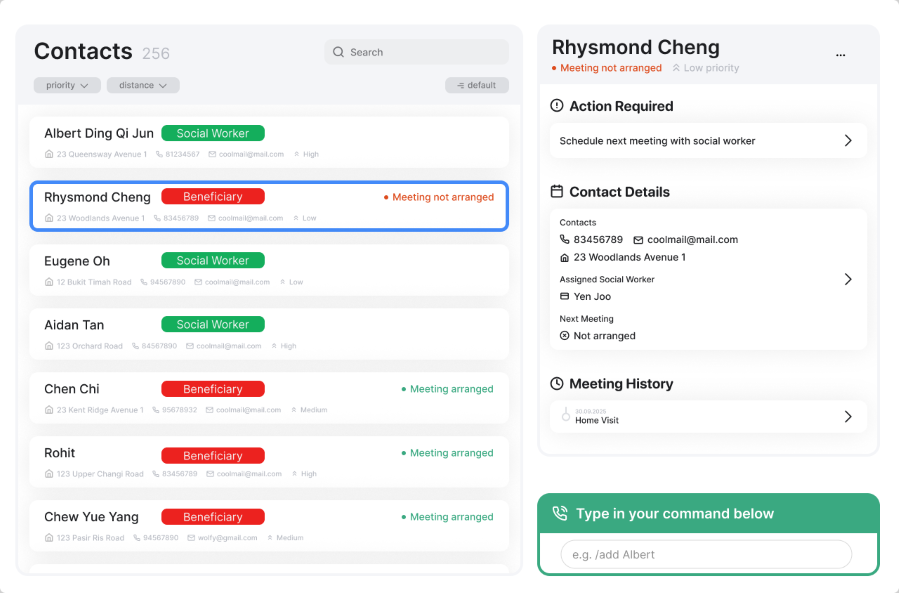
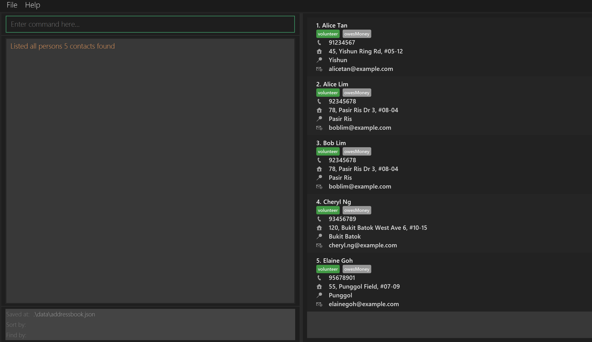
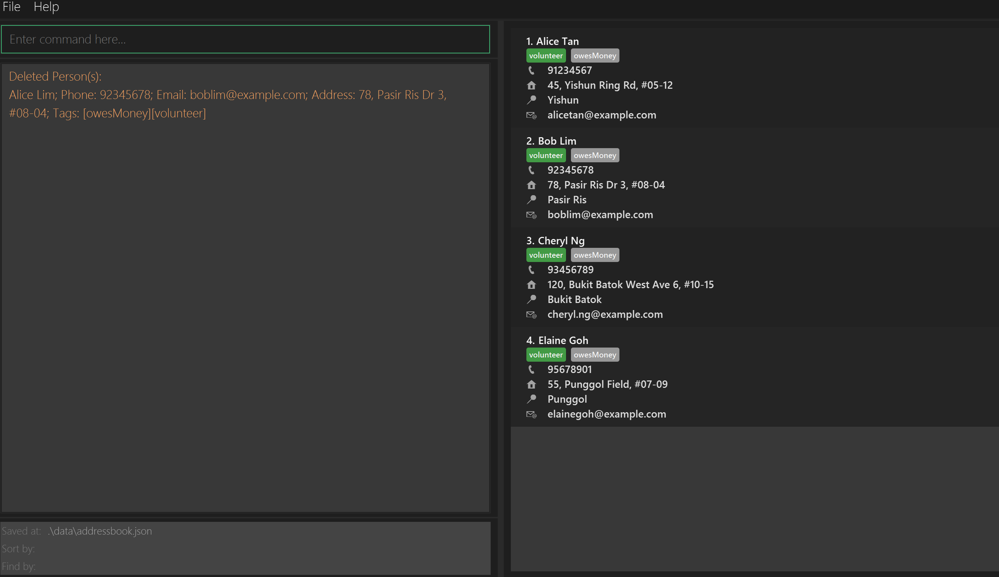
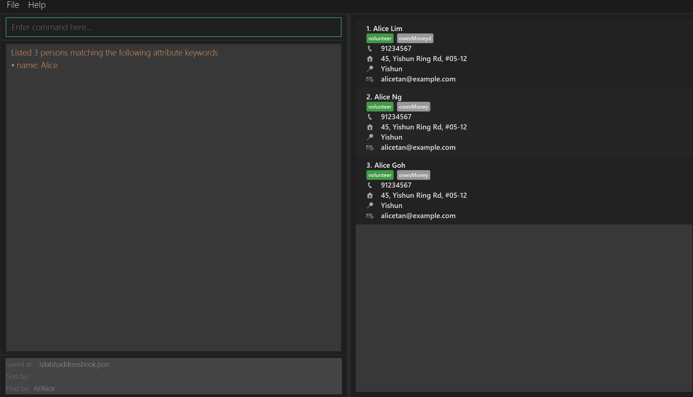
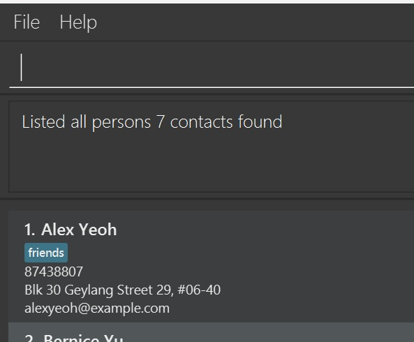
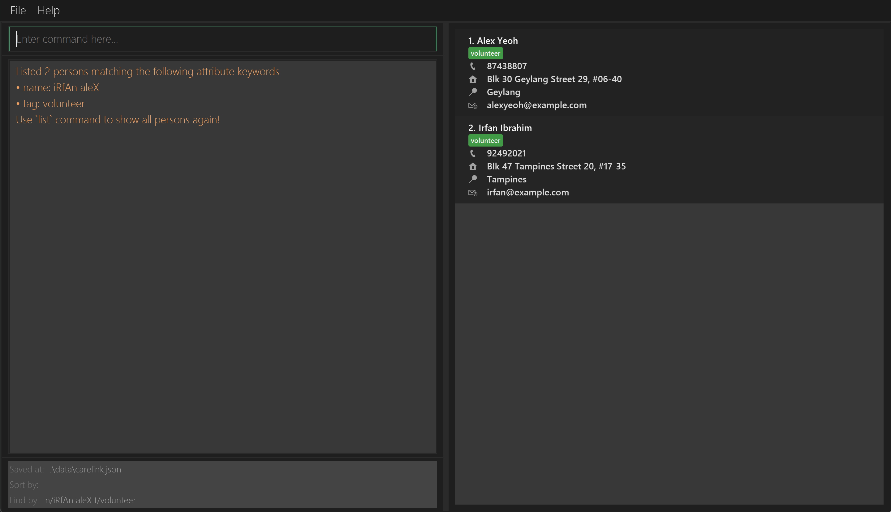
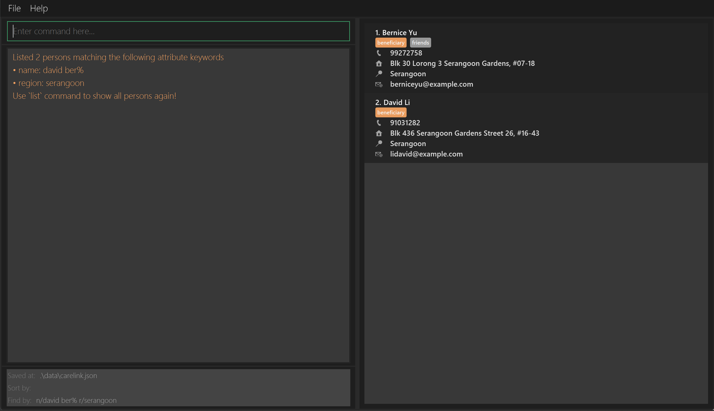
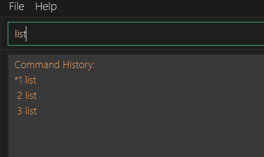
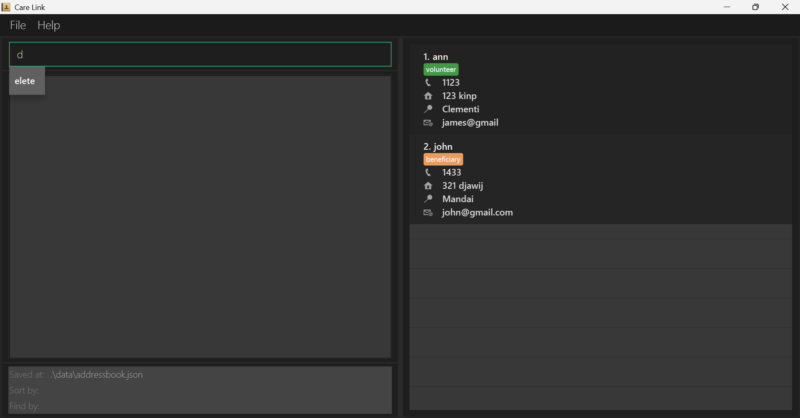
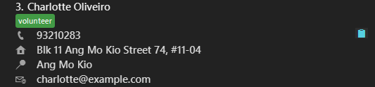

CareLink helps Non-Governmental Organisations (NGOs) deliver social assistance efficiently by
connecting beneficiaries to volunteers as quickly as possible. 

NGOs often serve a large number of beneficiaries with a limited pool of volunteers,
making it challenging to respond promptly to those in need.

By consolidating beneficiary and volunteer data into a single, streamlined system, CareLink enables dispatchers to:

* create and update records for beneficiaries and volunteers
* access information quickly using **optimized find and sort commands**
* automatically identify the **closest available volunteer**
* reduce errors and delays caused by manual lookups or outdated records

In short, CareLink helps dispatchers quickly access and update beneficiary and volunteer records. 

## Table of Contents

- [Quick start](#quick-start)

- <a href="#features">Features</a>

    - [Command Format](#command-format)

    - [Viewing help : `help`](#viewing-help--help)

    - <a href="#contacts-management">Contacts Management</a>

      - [Adding a contact: `add`](#adding-a-contact-add)

      - [Editing a contact : `edit`](#editing-a-contact--edit)

      - [Deleting a contact : `delete`](#deleting-a-contact--delete)

      - [Clearing all entries : `clear`](#clearing-all-entries--clear)

    - <a href="#display-and-searching">Display and Searching</a>

      - [Listing all contacts : `list`](#listing-all-contacts--list)

      - [Locating contacts: `find`](#locating-contacts-find)

      - [Sorting contacts: `sort`](#sorting-contacts-sort)

      - [Searching for closest contacts: `closest`](#searching-for-closest-contact-closest)

    - <a href="#advanced-features">Advanced Features</a>

      - [Cycling between commands : `UP_Key DOWN_Key`](#cycling-between-commands)

      - [Autocomplete : `TAB_Key`](#autocomplete)

      - [Copying data via Clipboard button](#copying-data-via-clipboard-button)

      - [Saving the data](#saving-the-data)

      - [Editing the data file](#editing-the-data-file)

      - [Archiving data files `[coming in v2.0]`](#archiving-data-files-coming-in-v20)

    - [Exiting the program : `exit`](#exiting-the-program--exit)

    - [Valid Attributes for contact](#valid-attributes)

- [FAQ](#faq)

- [Known issues](#known-issues)

- [Command summary](#command-summary)

--------------------------------------------------------------------------------------------------------------------

## Quick start

#### 1️⃣ Install Java (if you haven’t already)

CareLink requires **Java 17 or above** to run.

* If **Java 17 or above** is not installed, please follow the specific installation instructions mentioned [here](https://se-education.org/guides/tutorials/javaInstallation.html) to avoid version issues

**:information_source: Follow the guide that fits your computer's operating system** 

#### 2️⃣ Download CareLink

Download the latest **CareLink `.jar` file** from our [Releases page](https://github.com/AY2526S1-CS2103T-W13-1/tp/releases).

#### 3️⃣ Choose a Home Folder

Move the downloaded `.jar` file to a folder where you want CareLink to store your volunteer and organization data.
You get to choose the location. Treat it as your _CareLink Home Folder_.

#### 4️⃣ Launch CareLink

1.  Open your **Command Prompt** for Windows / **Terminal** for Mac/Linux

2.  Navigate to your CareLink Home folder:

    `cd path/to/home_folder` 

    For example, if CareLink Home folder is `C:/usr/Downloads/CareLink`, run the command `cd C:/usr/Downloads/CareLink`.

    Your terminal should now show you are inside that folder.

3.  Run CareLink:

    `java -jar carelink.jar`

 
About 10 seconds later, the CareLink interface will greet you with sample volunteer and beneficiary data so you can explore comfortably.

#### 5️⃣ Try Out Some Commands

In the command box at the top left, type a command and hit **Enter** to execute.

Some useful examples for volunteer admin staff:

   * `list` : Lists all contacts.

   * `add n/John Doe p/98765432 e/johnd@example.com a/John street, block 123, #01-01 r/yishun t/volunteer` : Adds a contact named `John Doe` to the Address Book.

   * `delete 3` : Deletes the 3rd contact shown in the current list.

   * `clear` : Deletes all contacts. You can use this once you are ready to add your own data.

   * `exit` : Exits the app.

#### 6️⃣ Learn More

Details of every feature and command can be found in the [Features](#features) section below. You will soon explore assigning roles, tracking participation, and keeping volunteer and beneficiary info updated effortlessly!

-----

## Features
-----

### Command Format

**:information_source: Notes about the command format:** 

* Words in `UPPER_CASE` are the attributes to be supplied by the user. 
  e.g. in `add n/NAME`, `NAME` is an attribute which can be used as `add n/John Doe`, `n/` is its attribute prefix.

* Items in square brackets are optional. 
  e.g `n/NAME [t/TAG]` can be used as `n/John Doe t/friend` or as `n/John Doe`.

* Items in with `|` are valid inputs. 
  e.g `t/volunteer|beneficiary` can be used as `t/volunteer` or as `t/beneficiary`.

* Items with `…`​ after them can be used multiple times including zero times. 
  e.g. `[t/TAG]…​` can be used as ` ` (i.e. 0 times), `t/friend`, `t/friend t/family` etc.

* Attributes can be in any order. 
  e.g. if the command specifies `n/NAME p/PHONE_NUMBER`, `p/PHONE_NUMBER n/NAME` is also acceptable.

* Extraneous attributes for commands that do not take in attributes (such as `help`, `list`, `exit` and `clear`) will be ignored. 
  e.g. if the command specifies `help 123`, it will be interpreted as `help`.

* If you are using a PDF version of this document, be careful when copying and pasting commands that span multiple lines as space characters surrounding line-breaks may be omitted when copied over to the application.

------

### Viewing help : `help`

Shows a message explaining how to access CareLink's help page.

**Format:** 
`help`

**Example:**
* `help` 

Simply click the `Copy URL` button to copy the link and paste it in your web browser of choice
(e.g. Google Chrome or Safari) to access the User Guide website.

  

[▲ Back to Table of Contents](#table-of-contents)

------

## Contacts Management
-----

### Adding a contact: `add`

Adds a contact to the address book.

**Format:** 
`add n/NAME p/PHONE_NUMBER e/EMAIL a/ADDRESS r/REGION t/volunteer|beneficiary [t/TAG]…​`

:information_source: **Important Note:**  
* Attributes must follow [Valid Attributes](#valid-attributes).
* A contact can have multiple tags, which must include a tag that is either one of volunteer or beneficiary (not both).
* A contact's attributes can be edited via [edit](#editing-a-contact--edit) later on, however all attributes must first be provided.

**Examples:**
* `add n/John Doe p/98765432 e/johnd@example.com a/John street, block 123, #01-01 r/woodlands t/volunteer`
will add John Doe to the list and set his attributes to the given attributes
* `add n/Betsy Crowe e/betsycrowe@example.com a/24 Mandai Garden street r/yishun p/1234567 t/beneficiary t/senior`
will add Betsy Crowe to the list and set her attributes to the given attributes

  

[▲ Back to Table of Contents](#table-of-contents)

------

### Editing a contact : `edit`

Edits an existing contact in the address book.

**Format:** 
`edit INDEX [n/NAME] [p/PHONE] [e/EMAIL] [a/ADDRESS] [r/REGION] [t/TAG]…​`

:information_source: **Important Note:**  
* Edits the contact at the specified `INDEX`. The index refers to the index number shown in the displayed contact list. The index **must be a positive integer** 1, 2, 3, …​
* The index is affected by `find` and `sort`.
* At least one of the optional fields must be provided.
* Attributes must follow [Valid Attributes](#valid-attributes).
* If tags are edited, must include a tag indicating volunteer or beneficiary (not both).
* Existing values will be updated to the input values.

:exclamation: **Caution:**  
When editing tags, the existing tags of the contact will be removed i.e adding of tags is not cumulative.

**Examples:**
*  `edit 1 p/91234567 e/johndoe@example.com`  
Edits the phone number and email address of the 1st contact to be `91234567` and `johndoe@example.com` respectively.
*  `edit 2 n/Betsy Crower`  
Edits the name of the 2nd contact to be `Betsy Crower`

  

[▲ Back to Table of Contents](#table-of-contents)

------
### Deleting a contact : `delete`

Deletes one or more specified contacts from the address book.

**Format:** 
`delete INDEX [MORE_INDEXES]...`

:information_source: **Important Note:**  
* Each index refers to the index number shown in the displayed contact list.
* A minimum of one index must be specified.
* Each index must be a **whole number greater than 0,** e.g. 1, 2, 3, …​
* The order of the indexes do not matter. 
* Spaces must be used to separate indexes.
* Duplicate indexes will be ignored.

**Examples:**
* `list` followed by `delete 2` 
 
Running `list` lists all contacts. 
Running `delete 2` deletes the second person in the list.
* `find n/alice` followed by `delete 1 2`
 
Running `find n/alice` displays all contacts named 'Alice'
 
`delete 1 2` deletes the first two contacts in the results of the `find` command.
  

[▲ Back to Table of Contents](#table-of-contents)

------

### Clearing all entries : `clear`

Deletes all contacts in the address book.

:exclamation: **Caution:**  
* This command will permanently delete **all** contacts in the address book.
* Please think carefully before executing this **irreversible** action.
* No extra input is needed.

**Format:** 
`clear`

**Example:**
* `clear` deletes all contacts in CareLink.

  

[▲ Back to Table of Contents](#table-of-contents)

------

## Display and Searching
-----

### Listing all contacts : `list`

Shows a list of all contacts in the address book.

**Format:** 
`list`

**Example:**
* `list` 
CareLink displays all volunteers' and beneficiaries' contact details. At the panel below the command box,
you can see the total number of contacts.

  

[▲ Back to Table of Contents](#table-of-contents)

------

### Locating contacts: `find`

Filters contacts whose fields match the keywords. 
You can use this to quickly identify or filter volunteers and beneficiaries based on their attributes.

**Format:** 
`find [n/NAME_KEYWORDS] [p/PHONE_KEYWORDS] [e/EMAIL_KEYWORDS] [a/ADDRESS_KEYWORDS] [t/TAG_KEYWORDS]`

:information_source: **Important Note:**  
* Keywords can be:
  * full words: `n/Alex` 
  * prefixes: `n/Al%` using `%` to indicate a prefix keyword
* If keyword is a full word, that attribute will only match full words.
  * `n/Han` will not match name `Hans`, `r/BukitTimah` will not match region `Bukit Timah`.
* If keyword is a prefix, that attribute will match any word containing the prefix.
  * `n/Han%` can match name `Hans` and `Bo Hans`.
* Keywords are <u>case-insensitive</u>.
* The order of the keywords does not matter.
* Multiple keywords per field are allowed.

:exclamation: **Caution:**
Prefix keyword searches are not supported for addresses.

 

:bulb: **Tip:**
Use [sort](#sorting-persons-sort) to rank the filtered contacts since `find` does not follow any specific order.

**Examples:**
* `find n/aleX iRfAn t/volunteer` 
Uses only full-word keywords to search for volunteers named Alex or Irfan.
  
 

* `find n/ale`  
CareLink found no results found as no volunteers have the full words `ale` in their names (in the sample data).
 

* `find n/david ber% r/serangoon`  
    
Uses a mix of prefix and full-word keywords to find `David Li` and `Bernice Yu` who stay in Serangoon.
 

[▲ Back to Table of Contents](#table-of-contents)

------

### Sorting contacts: `sort`

Sorts contacts by the fields in the order of the attribute prefixes

**Format:** 
`sort [n/] [p/] [e/] [a/] [t/]`

:information_source: **Important Note:**
* Order of sorting follows the natural order. e.g. 4th comes before 10th.
* Order of attribute prefixes defines the order of sorting.
* Sorting by **tags** will group the tags by **beneficiary** and **volunteer**.
* Calling sort after any command will sort the current displayed list.

**Examples:**
* `sort n/` will return all contacts sorted by their names in alphabetical order
* `sort n/ p/` will return all contacts sorted by name then phone number
* `sort p/ n/` will return all contacts sorted by phone number then name

  

[▲ Back to Table of Contents](#table-of-contents)

------

### Searching for closest contact: `closest`

Sorts volunteers/beneficiaries according to how close their region is to the region of the identified beneficiary/volunteer by the index provided. If the identified stakeholder is a volunteer, the list will only show beneficiaries and vice versa.

**Format:** 
`closest INDEX`

:information_source: **Important Note:**
* Overrides existing sort order
* Overrides existing find filters

:bulb: **Tip:**
Use [find](#locating-persons-find) and [sort](#sorting-persons-sort) to narrow down the beneficiary you want, then use closest to find volunteers close to the beneficiary.

This allows easy selection of volunteers to dispatch.

**Example:**
* Displays all volunteers/beneficiaries sorted according to how close their region is to the region of the identified beneficiary/volunteer by the index provided.
  * e.g. `closest 1` when beneficiary at index 1 has region Woodlands, will return all volunteers sorted by how close their region is to Woodlands

  

[▲ Back to Table of Contents](#table-of-contents)

------

## Advanced Features
-----

### Command History

Cycles between commands in the command history.

**Usage:** 
* Press `⬆ UP Key`: Cycles to more recent commands.

* Press `⬇ DOWN Key`: Cycles to older commands.

:information_source: **Important Note:**
* When you first press the `⬆ UP Key` or `⬇ DOWN Key`, the most recent command will show up.
* If you are at the most recent command (the top most command), pressing the `⬆ UP Key` will retrieve the oldest command.
* Likewise, if you are at the oldest command (the bottom most command), pressing the `⬇ DOWN Key` will retrieve the 
most recent command.
* Only the 5 most recent commands will be displayed in the command history.

**Example:**
* Command History List   
   
  After pressing either the `⬆ UP Key` or the `⬇ DOWN Key` for the first time since a valid command was executed,
the command history list is rendered in the result display.
The current command in the command history is prefixed with a `*` and is typed out in the command box.
    

[▲ Back to Table of Contents](#table-of-contents)

------

### Autocomplete

Provides suggestions to autocomplete your input text. Autocompletes command words and attribute prefixes like `n/`.

**⌨ Usage:** 
* Press `⇥ Tab`: Autocomplete with the suggestion that appears below command box.

:bulb: **Tip:**
Press **Tab** to complete the prefix and start typing an attribute. When you finish it, press **Space** and the next attribute prefix will be suggested automatically.

**Examples:**
* Autocomplete of command `delete`   
Typing the letter 'd' in an attempt to type the `delete` command will prompt autocomplete to suggest 'elete'. Pressing
`Tab` autocompletes the command rendering 'delete' in the command box.

  

[▲ Back to Table of Contents](#table-of-contents)

------

### Copying data via Clipboard button

For each entry in the display list, CareLink helps you quickly copy and paste details like Phone, Email and Address.

**Examples:**
* Copying details from the display list  
  
Hover your mouse over the attribute you want to copy to reveal the 📋 button that allows copying the data.

  

[▲ Back to Table of Contents](#table-of-contents)

------

### Saving the data

CareLink data is saved in the hard disk automatically after any command that changes the data. There is no need to save manually.

### Editing the data file

CareLink data are saved automatically as a JSON file `[JAR file location]/data/addressbook.json`. Advanced users are welcome to update data directly by editing that data file.

:exclamation: **Caution:**
If your changes to the data file makes its format invalid, CareLink will discard all data and start with an empty data file at the next run. Hence, it is recommended to take a backup of the file before editing it. 
Furthermore, certain edits can cause the CareLink to behave in unexpected ways (e.g., if a value entered is outside of the acceptable range). Therefore, edit the data file only if you are confident that you can update it correctly.

  

[▲ Back to Table of Contents](#table-of-contents)

------

### Archiving data files `[coming in v2.0]`

_Details coming soon ..._

------

### Exiting the program : `exit`

Exits the program.

**✏️ Format:** 
`exit`

  

[▲ Back to Table of Contents](#table-of-contents)

------

## Valid Attributes
### 👤 Name

Names can only contain alphanumeric characters, hyphens, and apostrophes, must not be blank, must not exceed 50 characters, and names cannot be purely numeric.

* `Alice Tan`
* `John'O'Doe`
* `Li Wei`
* `Aisyah`
* `Bob-2`

### 📧 Email

Emails must follow: `local-part@domain`, allowed special chars in local part (`+_.-`), no leading/trailing special chars, domain labels alphanumeric & ≥2 letters at the end.

* `alice@example.com`
* `john_doe123@mail.sg`
* `alex+promo@sub-domain.co.uk`
* `my.email@ntu.edu.sg`
* `contact-1@tech-startup.io`
* `user123@domain99.net`

### 📞 Phone Number

Digits and spaces only, must start and end with digits, have at least 3 digits, and must not exceed 50 characters.

* `999`
* `9876 5432`
* `65 1234 5600`
* `1800123`

### 🌍 Region

Regions must be a valid region (listed below):

Click to view all regions

* Woodlands
* Yishun
* Sembawang
* Mandai
* Sungei Kadut
* Punggol
* Sengkang
* Hougang
* Seletar
* Serangoon
* Pasir Ris
* Tampines
* Bedok
* Paya Lebar
* Changi
* Toa Payoh
* Bishan
* Ang Mo Kio
* Novena
* Geylang
* Marine Parade
* Kallang
* Queenstown
* Bukit Merah
* Bukit Timah
* Tanglin
* River Valley
* Jurong West
* Jurong East
* Boon Lay
* Clementi
* Bukit Batok
* Bukit Panjang
* Tuas
* Lim Chu Kang
* Western Water Catchment
* Tengah

### 🏠 Address

Address can be any non-blank string.

-   `21 Lower Kent Ridge Rd, Singapore`
-   `Block 123, #02-45 Clementi Ave 3`
-   `10 Dover Drive`
-   `Jurong West Street 42`
-   `Marina Bay Sands Tower 1`

### 🏷️ Tags

Tags are alphanumeric, at least one tag must be `volunteer` or `beneficiary`.

  

[▲ Back to Table of Contents](#table-of-contents)

------

## FAQ
**Q**: Where are my data files stored? 
**A**: In a folder named `data` in the same directory of `carelink.jar`, you can find the data file named `carelink.json`.
Data is only stored locally, saved automatically whenever commands that modify data are executed.

**Q**: How do I transfer my data to another Computer? 
**A**: Install the app in the other computer and overwrite the empty data file (`carelink.json`) it creates with the original data file.
If the data folder does not exist yet, you can simply copy over the entire `data` folder from your previous CareLink home folder.

**Q**: What do I do if I get an error message which says "Unknown command"? 
**A**: This means that the command you entered is not recognized by the application. Please ensure that you have typed the command correctly according to the formats specified in this user guide. You can type `help` to view the help window for reference.

  

[▲ Back to Table of Contents](#table-of-contents)

------

## :warning:Known issues

1. **When using multiple screens**, if you move the application to a secondary screen, and later switch to using only the primary screen, the GUI will open off-screen. The remedy is to delete the `preferences.json` file created by the application before running the application again.
2. **If you minimize the Help Window** and then run the `help` command (or use the `Help` menu, or the keyboard shortcut `F1`) again, the original Help Window will remain minimized, and no new Help Window will appear. The remedy is to manually restore the minimized Help Window.

  

[▲ Back to Table of Contents](#table-of-contents)

------

## Command summary

Action | Format, Examples
--------|------------------
**Add** | `add n/NAME p/PHONE_NUMBER e/EMAIL a/ADDRESS r/REGION t/volunteer|beneficiary [t/TAG]…​`   e.g., `add n/James Ho p/22224444 e/jamesho@example.com a/123, Clementi Rd, 1234665 r/woodlands t/volunteer`
**Clear** | `clear`
**Delete** | `delete INDEX [MORE_INDEXES]...`  e.g., `delete 1 3`
**Edit** | `edit INDEX [n/NAME] [p/PHONE] [e/EMAIL] [a/ADDRESS] [r/REGION] [t/TAG]…​`  e.g.,`edit 2 n/James Lee e/jameslee@example.com`
**Find** | `find [prefix/KEYWORDS]...`  e.g., `find n/Al% p/92813321`
**Sort** | `sort [prefix/]...`   e.g., `sort n/ p/`
**Closest** | `closest INDEX`   e.g., `closest 3`
**List** | `list`
**Help** | `help`

  

[▲ Back to Table of Contents](#table-of-contents)

------
